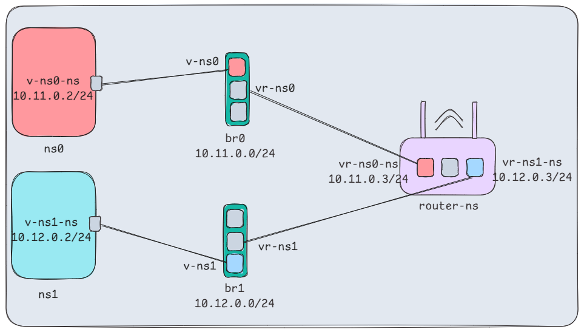

- [Initial Setup](#initial-setup)
- [TEST CONNECTIVITY](#test-connectivity)
  - [PING `ns0` to `br0`](#ping-ns0-to-br0)
  - [PING `ns0` to `10.11.0.3`](#ping-ns0-to-101103)
  - [PING `ns0` to `10.12.0.3`](#ping-ns0-to-101203)
  - [PING `ns0` to `br1`](#ping-ns0-to-br1)
  - [PING `ns0` to `ns1`](#ping-ns0-to-ns1)
  - [PING `ns1` to `ns0`](#ping-ns1-to-ns0)
- [Clean the Bridges and Namespaces](#clean-the-bridges-and-namespaces)

# Initial Setup

**⁠Create Network Bridges**

```sh
ip link add br0 type bridge
ip link add br1 type bridge
```

**Create Three Separate Network Namespaces**

```sh
ip netns add ns0
ip netns add ns1
ip netns add router-ns

# Verify namespace creation
ip netns
```

**Create Virtual Interfaces and Connections**

```sh
# Create appropriate virtual ethernet (veth) pairs
ip link add v-ns0-ns type veth peer name v-ns0
ip link add v-ns1-ns type veth peer name v-ns1

ip link add vr-ns0 type veth peer name vr-ns0-ns
ip link add vr-ns1 type veth peer name vr-ns1-ns

# Connect interfaces to correct namespaces
ip link set v-ns0-ns netns ns0
ip link set v-ns1-ns netns ns1

ip link set vr-ns0-ns netns router-ns
ip link set vr-ns1-ns netns router-ns

# Connect interfaces to appropriate bridges
ip link set v-ns0 master br0
ip link set v-ns1 master br1

ip link set vr-ns0 master br0
ip link set vr-ns1 master br1
```

**Ensure interfaces are properly configured and active**

```sh
# Bring bridges UP
ip link set br0 up
ip link set br1 up

# Bring NICs UP
ip link set v-ns0 up
ip link set v-ns1 up
ip link set vr-ns0 up
ip link set vr-ns1 up

ip netns exec ns0 ip link set v-ns0-ns up
ip netns exec ns1 ip link set v-ns1-ns up

ip netns exec router-ns ip link set vr-ns0-ns up
ip netns exec router-ns ip link set vr-ns1-ns up
```

**Configure IP Addresses**

```sh
# Assign appropriate IP addresses to all interfaces
# Ensure proper subnet configuration

# Assign IPs to bridges
ip addr add 10.11.0.1/24 dev br0
ip addr add 10.12.0.1/24 dev br1

# Assign IPs to NICs
ip netns exec ns0 ip addr add 10.11.0.2/24 dev v-ns0-ns
ip netns exec router-ns ip addr add 10.11.0.3/24 dev vr-ns0-ns

ip netns exec ns1 ip addr add 10.12.0.2/24 dev v-ns1-ns
ip netns exec router-ns ip addr add 10.12.0.3/24 dev vr-ns1-ns
```



# TEST CONNECTIVITY

For the current setup, it's possible to ping `10.11` and `10.12` networks from
the host:

```sh
# PING 10.11 NETWORK
ping 10.11.0.1 -c 3 # br0
ping 10.11.0.2 -c 3 # ns0
ping 10.11.0.3 -c 3 # router-ns

# PING 10.12 NETWORK
ping 10.12.0.1 -c 3 # br1
ping 10.12.0.2 -c 3 # ns1
ping 10.12.0.3 -c 3 # router-ns
```

However, `ns0`, `ns1` and `router-ns` cannot reach the host — there is no route
added to go the host.

**Our goal:** Enable `ns0` and `ns1` to communicate via the `router-ns`.

## PING `ns0` to `br0`

```sh
ip netns exec ns0 ping 10.11.0.1 -c 3 ✅
```

## PING `ns0` to `10.11.0.3`

```sh
ip netns exec ns0 ping 10.11.0.3 -c 3 ❌

# PING 10.11.0.3 (10.11.0.3) 56(84) bytes of data.
# --- 10.11.0.3 ping statistics ---
# 3 packets transmitted, 0 received, 100% packet loss, time 2050ms
```

The source and destination network match within `br0` network, then why `br0`
does not forward? Troubleshoot it:

```sh
tcpdump -i br0 icmp # ✅ Seen
ip netns exec router-ns tcpdump -i vr-ns0-ns icmp # ❌ Not seen
```

`br0` received the packets but `vr-ns0-ns` did not. Kernel is blocking
forwarding. Add rules to `iptables` so that `br0` can forward the packet:

```sh
iptables --append FORWARD --in-interface br0 --jump ACCEPT
iptables --append FORWARD --out-interface br0 --jump ACCEPT
```

## PING `ns0` to `10.12.0.3`

```sh
# Network is unreachable
ip netns exec ns0 ping 10.12.0.3 -c 3 ❌

# Check route table
ip netns exec ns0 route
# Destination     Gateway         Genmask         Flags Metric Ref    Use Iface
# 10.11.0.0       0.0.0.0         255.255.255.0   U     0      0        0 v-ns0-ns
```

`ns0` does not have any route information for `10.12` network. Add a route for
`10.12` network, use `v-ns0-ns` interface with `10.11.0.3` gateway:

```sh
ip netns exec ns0 ip route add 10.12.0.0/24 via 10.11.0.3 dev v-ns0-ns

# Ping again
ip netns exec ns0 ping 10.12.0.3 -c 3 ✅
```

## PING `ns0` to `br1`

```sh
ip netns exec ns0 ping 10.12.0.1 -c 3 #❌ Still fails.
# PING 10.12.0.1 (10.12.0.1) 56(84) bytes of data.
# --- 10.12.0.1 ping statistics ---
# 3 packets transmitted, 0 received, 100% packet loss, time 2058ms
```

Troubleshooting:

```sh
ip netns exec router-ns tcpdump -i vr-ns0-ns icmp  # ✅ Seen
ip netns exec router-ns tcpdump -i vr-ns1-ns icmp # ❌ Not seen
```

`vr-ns0-ns` received the packet but `vr-ns1-ns` does not. That means `router-ns`
blocks forwarding the packet from `vr-ns0-ns` to `vr-ns1-ns` because otherwise
`router-ns` has to forward the packet outside of it.

As forwarding is blocked inside `router-ns`, **enable IP forwarding** inside
`router-ns`:

```sh
ip netns exec router-ns sysctl -w net.ipv4.ip_forward=1

## Control forwarding with rules.
# Set default FORWARD policy to DROP for safety.
ip netns exec router-ns iptables -P FORWARD DROP
```

As `vr-ns0-ns` could not forward the packet, add rules to `iptables` for it:

```sh
# Allow forwarding on router-ns interfaces
ip netns exec router-ns iptables --append FORWARD --in-interface vr-ns0-ns --jump ACCEPT
ip netns exec router-ns iptables --append FORWARD --out-interface vr-ns0-ns --jump ACCEPT

# Verify added rules
ip netns exec router-ns iptables -v -L FORWARD
```

## PING `ns0` to `ns1`

```sh
ip netns exec ns0 ping 10.12.0.2 -c 3 #❌Still fails
```

Troubleshooting:

```sh
# Place an agent at br1
tcpdump -i br1 icmp

# Place an agent at ns1
ip netns exec ns1 tcpdump -i v-ns1-ns icmp
```

`br1` did not forward the packets to `ns1`. As `br1` lives in the host, it
blocks forwarding for `br1`. Lets add rules to iptables for `br1`:

```sh
iptables -A FORWARD --in-interface br1 -j ACCEPT
iptables -A FORWARD --out-interface br1 -j ACCEPT

# Verify the rules
iptables -v -L FORWARD
```

Now, if we ping again, `ns1` received the packets but could not reply.

```sh
ip netns exec ns1 route
```

`ns1` does not have any information about `10.11` network to reply. To reply to
`10.11` network, add `10.11`, use `10.12.0.3` as gateway so that `br1` can
forward the packet (via `vr-ns1`→`vr-ns0-ns`):

```sh
ip netns exec ns1 ip route add 10.11.0.0/24 via 10.12.0.3 dev v-ns1-ns
```

```sh
ip netns exec ns0 ping 10.12.0.2 -c 3 ✅
# PING 10.12.0.2 (10.12.0.2) 56(84) bytes of data.
# 64 bytes from 10.12.0.2: icmp_seq=1 ttl=63 time=0.083 ms
# 64 bytes from 10.12.0.2: icmp_seq=2 ttl=63 time=0.071 ms
# 64 bytes from 10.12.0.2: icmp_seq=3 ttl=63 time=0.106 ms
# --- 10.12.0.2 ping statistics ---
# 3 packets transmitted, 3 received, 0% packet loss, time 2087ms
```

## PING `ns1` to `ns0`

```sh
ip netns exec ns1 ping 10.11.0.2 -c 3 ✅
```

We have added `iptables` rules only for `vr-ns0-ns` but not for `vr-ns1-ns`. but
still ping from `ns1` to `ns0` works because by default, the `nf_tables` may
have allowed forwarding by default unless explicitly denied.

It's a good practice to explicitly add iptables rules for both interfaces to
avoid unexpected behavior:

```sh
ip netns exec router-ns iptables --append FORWARD --in-interface vr-ns1-ns --jump ACCEPT
ip netns exec router-ns iptables --append FORWARD --out-interface vr-ns1-ns --jump ACCEPT
```

# Clean the Bridges and Namespaces

```sh
# Delete bridges
ip link del br0
ip link del br1

# Delete namespaces
ip netns del router-ns
ip netns del ns0
ip netns del ns1
```
